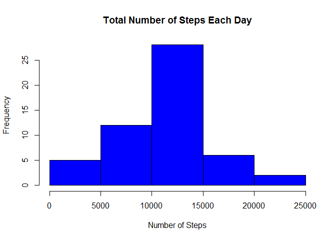

# Reproducible Research: Peer Assessment 1


## Loading and preprocessing the data

Load Activity Data into Data Frame


```r
data <- read.csv("activity.csv")
```


## What is mean total number of steps taken per day?

1. Number of steps taken per day.


```r
steps_taken_per_day <- aggregate(steps ~ date, data, sum)
```

2. Histogram of the total number of steps taken each day.


```r
hist(steps_taken_per_day$steps, xlab="Number of Steps", main="Total Number of Steps Each Day", col="blue")
```

<!-- -->

3. Mean and Median of the total number of steps taken per day


```r
steps_mean <- mean(steps_taken_per_day$steps)
steps_median <- median(steps_taken_per_day$steps)
```
The mean is 1.0766189\times 10^{4} and median is 10765


## What is the average daily activity pattern?

1. Time series plot of the 5-minute interval (x-axis) and the average number of steps taken, averaged across all days (y-axis)


```r
steps_by_interval <- aggregate(steps ~ interval, data, mean)

plot(steps_by_interval$interval,steps_by_interval$steps, type="l", xlab="Interval", ylab="Number of Steps",main="Average Number of Steps per Day by Interval")
```

<!-- -->

2. Maximum number of steps per 5 minute interval


```r
max_steps_row <- which.max(steps_by_interval$steps)
steps_by_interval [max_steps_row, ]
```

```
##     interval    steps
## 104      835 206.1698
```

The interval 835 has the maximum average number of steps 206.1698113. ` 

## Imputing missing values

1. Calculate and report the total number of missing values in the dataset (i.e. the total number of rows with NAs)


```r
total_nas <- sum(is.na(data))
```

The total number of rows with NA's is 2304

2. Devise a strategy for filling in all of the missing values in the dataset. The strategy does not need to be sophisticated. For example, you could use the mean/median for that day, or the mean for that 5-minute interval, etc.


```r
for (i in 1:nrow(data)){
  if (is.na(data$steps[i])){
    interval_val <- data$interval[i]
    row_id <- which(steps_by_interval$interval == interval_val)
    steps_val <- steps_by_interval$steps[row_id]
    data$steps[i] <- steps_val
  }
}
```

3. Create a new dataset that is equal to the original dataset but with the missing data filled in.


```r
data_new <- aggregate(steps ~ date, data, sum)
```

4. Make a histogram of the total number of steps taken each day and Calculate and report the mean and median total number of steps taken per day. Do these values differ from the estimates from the first part of the assignment? What is the impact of imputing missing data on the estimates of the total daily number of steps?


```r
hist(data_new$steps,  col="blue", main="Histogram of total number of steps per day", xlab="Total number of steps in a day")
```

<!-- -->

## Are there differences in activity patterns between weekdays and weekends?

1. Create a new factor variable in the dataset with two levels - "weekday" and "weekend" indicating whether a given date is a weekday or weekend day.


```r
data$date <- as.Date(data$date, "%Y-%m-%d")
data$day <- weekdays(data$date)
data$day_type <- c("weekday")

for (i in 1:nrow(data)){
  if (data$day[i] == "Saturday" || data$day[i] == "Sunday"){
    data$day_type[i] <- "weekend"
  }
}

data$day_type <- as.factor(data$day_type)
table_interval_steps_imputed <- aggregate(steps ~ interval+day_type, data, mean)
```

2. Make a panel plot containing a time series plot (i.e. type = "l") of the 5-minute interval (x-axis) and the average number of steps taken, averaged across all weekday days or weekend days (y-axis). See the README file in the GitHub repository to see an example of what this plot should look like using simulated data.


```r
library(ggplot2)
```

```
## Warning: package 'ggplot2' was built under R version 3.2.4
```

```r
qplot(interval, steps, data=table_interval_steps_imputed, geom=c("line"), xlab="Interval", 
      ylab="Number of steps", main="") + facet_wrap(~ day_type, ncol=1)
```

<!-- -->
